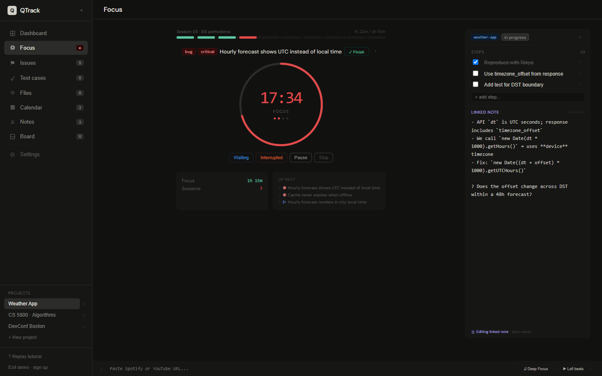
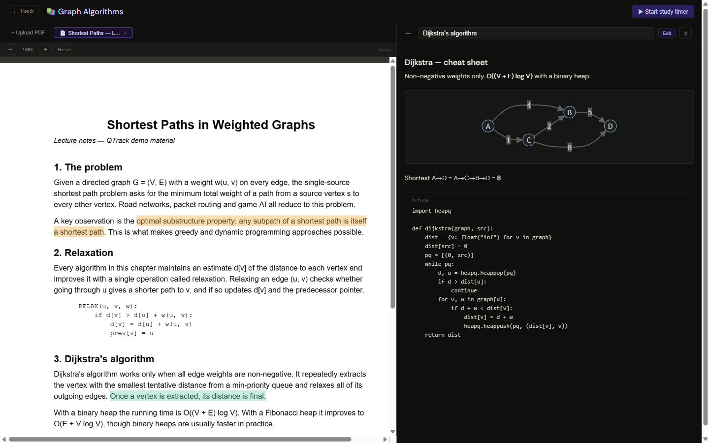
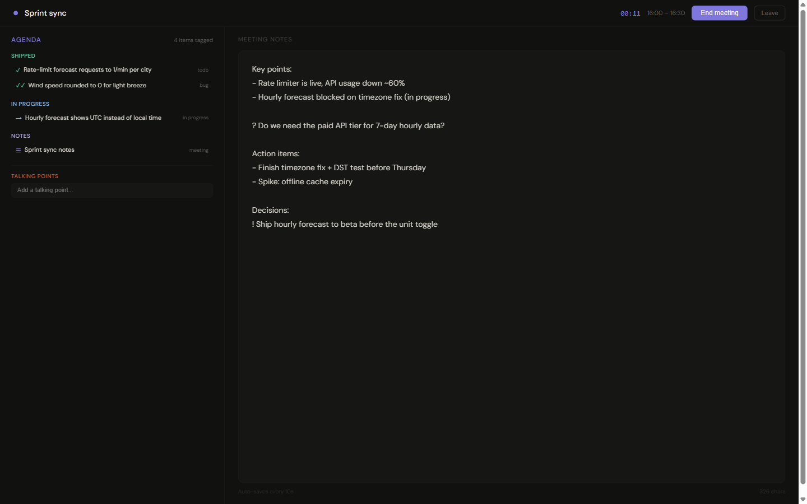
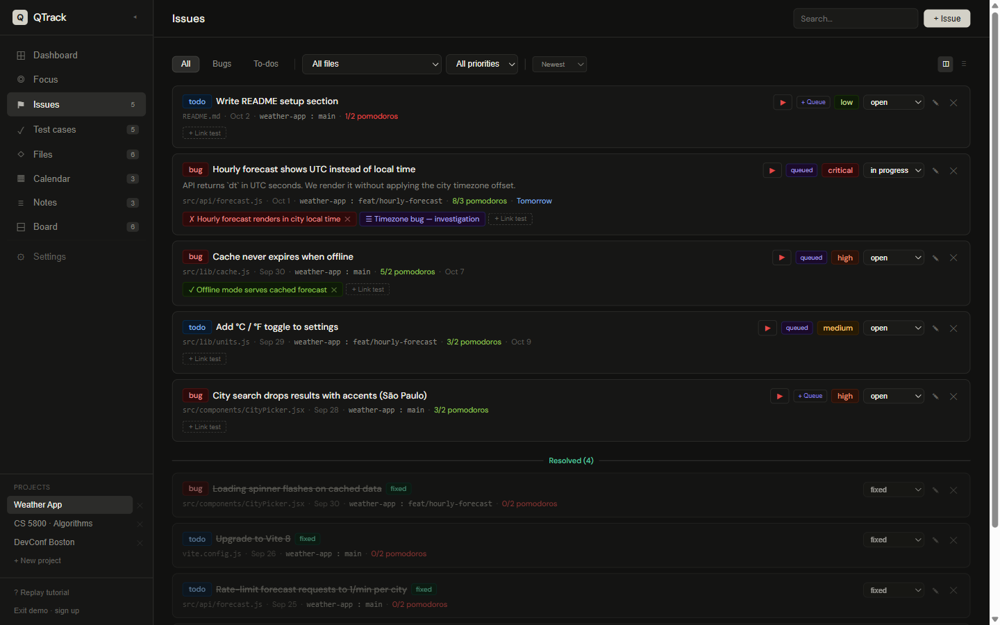
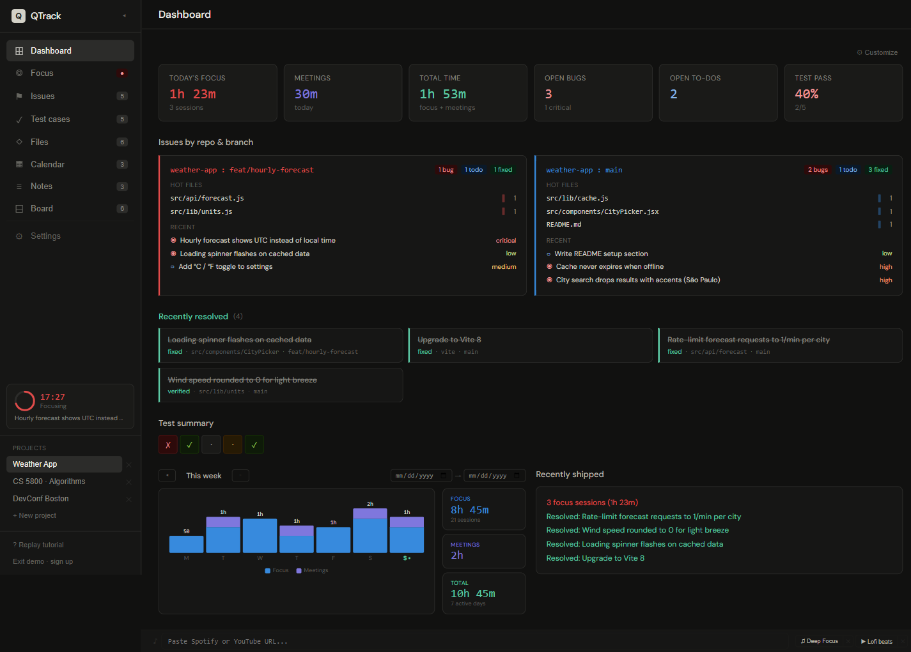

# QTrack

A personal workspace for developers, students, and anyone who lives in their notes. It brings a Pomodoro focus timer, tasks, meetings, notes, and study material together in one dark-themed app.

Queue up what you need to do and run focus sessions against it. Keep notes with code and diagrams, and walk into meetings with an agenda that's already filled in. You can also read PDFs and turn highlights into notes. Developers get issues, test cases, and repo/branch tracking. Students and note-takers get study topics, a PDF reader, and a notes space that links everything together.

**[▶ Try the live demo](https://qtrack-steel.vercel.app/demo)** (no sign-up needed) · [Create an account](https://qtrack-steel.vercel.app/)



---

## Features

### ◎ Focus
A Pomodoro timer that knows what you're working on.

- 25 / 5 / 15 cycle with a long break after every 4 sessions, plus browser notifications and a chime
- Attach a session to an issue, test case, or study topic. Pomodoros are counted against each task's estimate
- Pause with a reason (*waiting*, *interrupted*). That time is logged separately and doesn't count as focus
- **Up next** queue you can reorder by dragging
- **Context drawer** for the current task, with a step checklist and a scratchpad that saves to the linked note
- The timer is saved to the server, so it survives refreshes and syncs across devices
- Log past work manually, get break ideas (with a 🏢 office / 🏠 home toggle), and play music from YouTube or Spotify in the bottom dock

### ★ Study mode
Topics, PDFs, and notes in one place.



- Group material into **topics**. Each topic shows its note count and the time you've studied it
- Upload PDFs and read them in the built-in reader (pdf.js). **Select text to highlight it and create a note**, and click a highlight to jump back to that note
- Study notes render full **Markdown**, **Mermaid** diagrams, and syntax-highlighted code
- Start a study timer from any topic. That time feeds the topic stats and your dashboard

### ≡ Notes
- Categories (*scratch, decision, investigation, meeting*) and pinning
- Fenced code blocks with syntax highlighting
- Link a note to an issue, test case, file, repo, or meeting

### ▦ Calendar & meetings
Walk into every meeting already prepared.



- Month calendar with meetings (including recurring ones) and due dates from tasks
- **Tag a task or note with a meeting** and it shows up on that meeting's agenda, grouped into *shipped*, *in progress*, and *notes*. Only items that changed since the last meeting you attended are included
- Join a meeting to get a timer and a notes pad that saves automatically. Track attendance, cancellations, and talking points

### ⚑ Issues & test cases
Lightweight tracking for code you're working on.



- **Issues** are bugs or todos, with priority, status, due date, estimated pomodoros, and repo/branch. Attaching a file is optional, so general todos work too
- **Test cases** have preconditions, inline-editable steps with expected results, and pass/fail/blocked status
- Link issues to test cases. Filter, sort, switch between cards and a list, and add any task to the focus queue with one click

### ⊞ Dashboard



- Today's focus and meeting time, open bugs and todos, and test pass rate
- Open work grouped by **repo : branch**, with "hot" files
- Recently resolved items, and a weekly focus/meetings chart you can page through by week
- Pick which widgets the dashboard shows, and choose which sidebar tabs each project shows in **Settings**

### And also
- **Board:** a sticky-note Kanban per project. Cards can become issues
- **Workshop projects:** a project type for conferences, with *Sessions* (speaker, track, rating) and *People* you met with follow-ups. Its dashboard collects lines starting with `!` (action items), `?` (questions), and `★` (insights) from your notes
- **News** *(premium)*: an AI-curated feed for topics you choose, served by a Supabase Edge Function
- **Guided tour** on first visit, which you can replay from the sidebar

---

## Tech stack

| Layer | Choice |
|---|---|
| UI | React 19 (inline styles, no UI library), DM Sans |
| Build | Vite 8 |
| Backend | Supabase: Postgres with Row Level Security, Auth (email, GitHub, Google), Storage, Realtime, Edge Functions |
| Loaded on demand | `pdfjs-dist` and `mermaid` from esm.sh, YouTube IFrame API |
| Hosting | Vercel |

---

## Getting started

### Try it without setup
Open **[/demo](https://qtrack-steel.vercel.app/demo)**. The demo runs the full app against sample data stored in your browser, with no account and no backend. Your changes stay on your device, and the data resets each day.

### Run it locally

**Prerequisites:** Node.js 20+ and a [Supabase](https://supabase.com) project.

```bash
git clone https://github.com/Subhash-269/qtrack.git
cd qtrack
npm install
```

Create `.env` in the project root:

```env
VITE_SUPABASE_URL=https://<your-project>.supabase.co
VITE_SUPABASE_ANON_KEY=<your-anon-key>
```

Then:

```bash
npm run dev       # http://localhost:5173  (demo mode: http://localhost:5173/demo)
npm run build     # production build → dist/
npm run preview   # serve the build locally
```

Demo mode doesn't need Supabase at all, so `/demo` works even before you've set up `.env`.

### Supabase setup

The app expects these tables, each scoped by `user_id` with RLS:

```
projects          files            issues           test_cases
issue_test_links  focus_sessions   timer_state      task_queue
meetings          notes            study_docs       study_highlights
board_columns     board_cards      workshop_people  news_cache
user_profiles
```

You'll also need:
- A Storage bucket named **`study-docs`** for PDFs
- Realtime enabled on `timer_state` for cross-device timer sync
- Email auth, plus GitHub/Google providers if you want them. Add your dev and prod URLs to the allowed redirect URLs
- *(Optional)* An Edge Function named **`news-feed`** for the News tab

> The exact columns each table uses are in [`src/storage.js`](src/storage.js). The sample rows in [`src/demo/seed.js`](src/demo/seed.js) show the expected shape of each record.

---

## Project structure

```
src/
├── main.jsx              # Auth gate: <Auth/> or <App/> depending on the session
├── Auth.jsx              # Sign in / sign up / "Try the demo"
├── App.jsx               # Every view: Focus, Dashboard, Issues, Notes, Study, Calendar, …
├── storage.js            # Data layer: all Supabase queries, grouped by domain
├── supabaseClient.js     # Real Supabase client, or the demo client on /demo
└── demo/
    ├── mockSupabase.js   # In-browser stand-in for the Supabase client (localStorage-backed)
    └── seed.js           # Sample projects: a dev project, a course, and a conference
public/demo/              # Sample PDF used by the demo
docs/screenshots/         # Images used in this README
```
